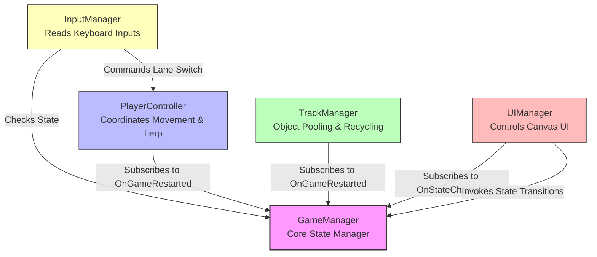

# Protótipo Infinite Runner 3D - Unity

Este repositório contém o código-fonte de um protótipo mínimo funcional de um jogo do estilo **Infinite Runner 3D**, desenvolvido em Unity 3D e C# para fins acadêmicos.

O objetivo do projeto é demonstrar a aplicação prática de padrões de projeto e boas práticas de arquitetura de software para jogos, tais como o **Princípio de Responsabilidade Única (SRP)**, **Acoplamento Fraco (Loose Coupling)** por meio de eventos, e otimização de memória através de **Object Pooling**.

---

## 🚀 Funcionalidades do MVP

* **Sistema de 3 Faixas (Lanes)**: Movimentação lateral fixa e suave do jogador (Esquerda: $X=-3$, Centro: $X=0$, Direita: $X=3$) interpolada por Lerp.
* **Cenário Infinito (Object Pooling)**: Reciclagem matemática e contínua de segmentos de pista no eixo Z, otimizando o uso de memória (evitando `Instantiate` e `Destroy` frequentes).
* **Máquina de Estados Simples**: Estados de jogo (`Stopped` e `Running`) com bloqueio de entradas do jogador quando pausado.
* **Interface do Usuário (UI Canvas)**: Botões para Iniciar, Parar (Pausar) e Reiniciar (Reset completo de posições e faixas).
* **Câmera Fixa**: Posicionamento ideal mostrando as três faixas e o jogador sem deslocamento.

---

## 🏗️ Arquitetura do Software

A estrutura foi projetada para ser modular e facilmente explicável em apresentações acadêmicas. O diagrama de dependências abaixo ilustra as relações entre componentes:



### Componentes Principais
* **`GameManager`**: Centraliza o estado do jogo e gerencia o ciclo de vida disparando eventos de reinicialização e mudança de estado.
* **`PlayerController`**: Gerencia a faixa atual e interpola suavemente a coordenada X do jogador.
* **`InputManager`**: Captura as teclas `A` e `D` (ou setas) e repassa os comandos ao jogador apenas se o jogo estiver rodando.
* **`TrackManager`**: Gerencia a criação, movimentação e reposicionamento matemático dos segmentos da pista de forma cíclica.
* **`UIManager`**: Escuta eventos do GameManager para exibir ou ocultar os botões do Canvas.

---

## 📁 Estrutura de Pastas

```text
Assets/
├── Materials/        # Materiais básicos (Player e Pista)
├── Prefabs/          # Prefab do segmento de pista reciclada
├── Scenes/           # Cena principal do protótipo
└── Scripts/
    ├── Core/         # GameManager.cs
    ├── Input/        # InputManager.cs
    ├── Player/       # PlayerController.cs
    ├── Track/        # TrackManager.cs
    └── UI/           # UIManager.cs
```

---

## 🛠️ Como Instalar e Configurar na Unity

1. Certifique-se de ter a **Unity** instalada (Compatível com Unity 6 e versões recentes).
2. Clone este repositório no seu computador:
   ```bash
   git clone <url-do-repositorio>
   ```
3. Abra a Unity Hub e adicione o projeto a partir da pasta clonada.
4. Monte a hierarquia de objetos e interligue os componentes no Inspector conforme detalhado no arquivo de documentação complementar:
   * Consulte: [arquitetura_infinite_runner_3d.md](./Assets/../arquitetura_infinite_runner_3d.md) para o guia visual completo de montagem.

---

## ✅ Testes de Aceitação

O protótipo atende aos seguintes requisitos:

* **[OK]** Movimentação lateral correta (A vai para esquerda, D vai para direita).
* **[OK]** Limite de faixas respeitado (Player não passa da faixa esquerda ou direita).
* **[OK]** Pausa funcional (botão Parar congela o cenário e impede movimentação sem apagar a posição atual).
* **[OK]** Reinício completo (botão Reiniciar restaura o jogador ao centro e reposiciona as pistas perfeitamente no ponto de origem).
* **[OK]** Object pooling contínuo e sem interrupções visuais na pista.

---

## 📜 Licença

Este projeto é disponibilizado para fins puramente acadêmicos e educacionais. Sinta-se livre para estendê-lo adicionando obstáculos, pontuação ou power-ups!
